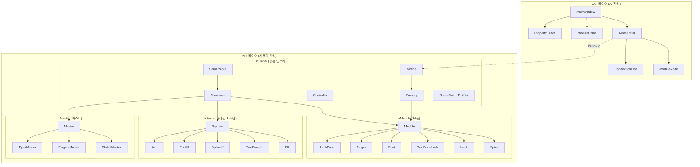

# ironRig 코드베이스 분석

## 개요

ironRig는 **Maya에서 모듈 방식으로 컨트롤 리그를 만드는 프레임워크**입니다.

- **API 레이어** (`api/`) — Maya 리깅 로직 백엔드 (**사용자 작성**)
- **GUI 레이어** (`gui/`) — Qt 기반 노드 에디터 프론트엔드 (**AI 작성**)

---

## 아키텍처 다이어그램



---

## API 레이어 상세

### 핵심 클래스 계층

| 클래스 | 역할 |
|---|---|
| [Serializable](file:///d:/tools/maya/modules/ironRig/scripts/ironRig/api/irGlobal/serializable.py) | `id` 기반 hashmap으로 객체 관계 복원 |
| [Container](file:///d:/tools/maya/modules/ironRig/scripts/ironRig/api/irGlobal/container.py) | 네이밍, Side/Type enum, attach/detach, objectSet 관리 |
| [Controller](file:///d:/tools/maya/modules/ironRig/scripts/ironRig/api/irGlobal/controller.py) | JSON 커브 셰이프, zero/extra 그룹, SpaceSwitch 연동 |
| [Scene](file:///d:/tools/maya/modules/ironRig/scripts/ironRig/api/irGlobal/scene.py) | 전체 씬 관리. 직렬화/역직렬화로 파일 저장/로드 |
| [Factory](file:///d:/tools/maya/modules/ironRig/scripts/ironRig/api/irGlobal/factory.py) | 문자열 이름으로 Module/Master 인스턴스 생성 |

### Module 빌드 라이프사이클

```
preBuild() → build() → postBuild()
                ↓
   _buildSystems() → _connectSystems() → _buildOutputs() → _connectOutputs() → _connectSkeleton()
```

- **Guide 모드** (`preBuild()`): `orientPlane` 플러그인으로 조인트 방향 설정. 로케이터 수동 조절 가능
- **System 조인트**: IK/FK/Blend 등 시스템 구동 조인트
- **Out 조인트**: 최종 출력 → 스켈레톤에 `parentConstraint`로 연결

### 모듈별 고유 속성

| 모듈 | 고유 속성 | 비고 |
|---|---|---|
| **Neck** | `numberOfControllers` (int, min 2) | SplineIK 컨트롤러 개수 |
| **TwoBoneLimb** | `ikRootController` (bool), `nonroll` (bool), `detectInbetweenJoints` (bool) | IK/FK 블렌딩 |
| **Finger** | `curlStartIndex` (int) | 컬 시작 인덱스 |
| **Simple** | `simpleType` (FK/SINGLE), `controllerShape` | 범용 모듈 |
| **Foot** | 피봇 로케이터 위치 | Guide 모드에서 설정 |

### Master — 모듈 그룹

Master는 **여러 Module을 그룹화**하고 통합 컨트롤러를 제공합니다.

빌드 순서: *내부 모듈 빌드 → `addModules()` → `master.build()` → `attachTo(parentModule)`*

### API 사용 예제 워크플로우

[metahumanSkel_build.py](file:///d:/tools/maya/modules/ironRig/test/metahumanSkel_build.py) 기준:

```
1. PreCustomScript (새 씬 열기, 스켈레탈메시 레퍼런스 로드, 보조 조인트 생성)
2. GlobalMaster 빌드 (루트 조인트 지정)
3. Spine → Neck → Leg → Foot → Clavicle → Arm → Finger 순서로 모듈 빌드 + attachTo
4. FingersMaster 생성, 모듈 추가, 빌드, attachTo
5. SpaceSwitchBuilder 설정
6. PostCustomScript (메타휴먼 얼굴 연결 등)
```

---

## GUI 레이어 상세

| 파일 | 역할 |
|---|---|
| [mainWindow.py](file:///d:/tools/maya/modules/ironRig/scripts/ironRig/gui/mainWindow.py) | 메인 윈도우. 메뉴, 툴바, 독 위젯 |
| [nodeEditor.py](file:///d:/tools/maya/modules/ironRig/scripts/ironRig/gui/nodeEditor.py) | 핵심 노드 에디터. 커넥션, 패닝/줌, 빌드 실행 |
| [moduleNode.py](file:///d:/tools/maya/modules/ironRig/scripts/ironRig/gui/moduleNode.py) | 개별 노드 위젯. 포트, 디스플레이 플래그, 컨텍스트 메뉴 |
| [connectionLine.py](file:///d:/tools/maya/modules/ironRig/scripts/ironRig/gui/connectionLine.py) | Bezier 커넥션 라인 |
| [modulePanel.py](file:///d:/tools/maya/modules/ironRig/scripts/ironRig/gui/modulePanel.py) | 좌측 모듈 목록 (드래그&드롭) |
| [propertyEditor.py](file:///d:/tools/maya/modules/ironRig/scripts/ironRig/gui/propertyEditor.py) | 우측 속성 에디터 |

### 현재 빌드 파이프라인

1. 모듈 패널에서 드래그&드롭 → 노드 생성
2. 포트 연결로 계층 구성
3. Display Flag 클릭 → `buildRig()` 실행
4. DFS 위상 정렬 → 의존성 순서대로 빌드

---

## 개선 방향 요약

개선 계획서: [implementation_plan.md](file:///C:/Users/stakl/.gemini/antigravity/brain/6c136775-5768-4632-9ffb-9e4bf3267c81/implementation_plan.md)

| # | 항목 | 설명 |
|---|---|---|
| 1 | **포트 방향 반전** | Top-Down 계층 구조 (부모 → 자식 방향) |
| 2 | **Master 그룹 컨테이너** | Module을 감싸는 시각적 그룹 UI |
| 3 | **Guide 모드 Flag** | 노드 왼쪽에 Guide Flag 추가 + 오리엔트 데이터 저장 |
| 4 | **Save/Load 통합** | API `buildFromFile()` 수준의 완전한 빌드 파이프라인 |
| 5 | **Property Editor 개선** | 모듈별 고유 속성(numberOfControllers, nonroll 등) 반영 |
